= Documentació de la Memòria
:toc:

== Sprint 1
=== Planificació inicial 
==== Board inicial 
===== Eduardo 
.Imatge del board inicial
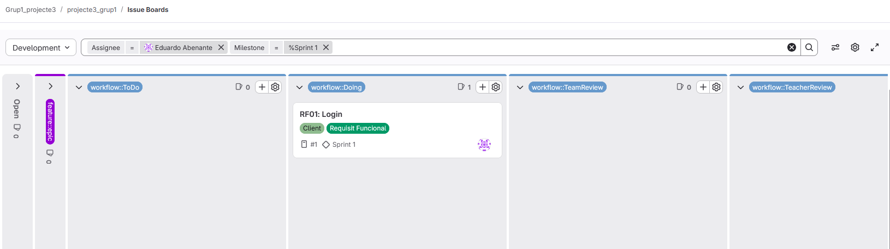

===== Diyae
.Imatge del board inicial
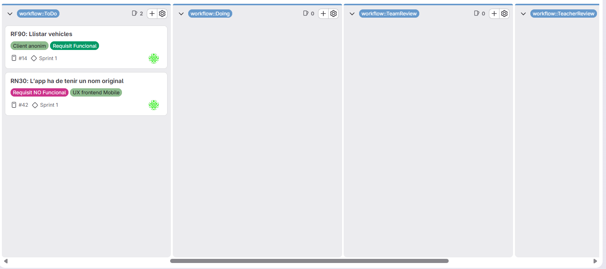

===== Angel 
.Imatge del board inicial
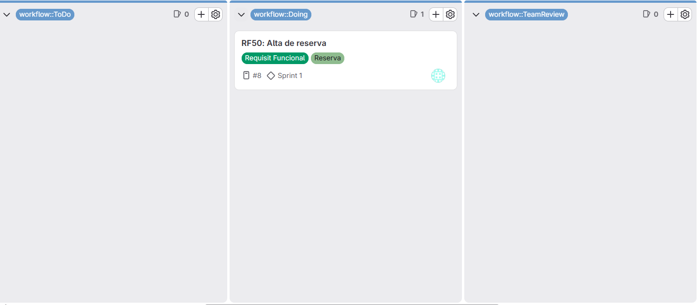

=== Daily Standups
==== Divendres 13 de Febrer

[cols="5*", options="header"]
|=====================================================================
| Integrant | Què es va fer ahir | Què es farà avui | Quins problemes o preocupacions es tenen | Hores treballades (classe/casa)

| Eduardo
| -
| Organitzar el projecte, preparar el board i el repositori, repartir rols provisionalment, assignar tasques inicials
| Fa la impressió que hi ha menys temps del que sembla i hi ha tot un projecte per fer
| 3/1

| Diyae
| -
| Falta
| Falta
| Falta

| Angel
| -
| Falta
| Falta
| Falta
|=====================================================================

==== Dimarts 17 de Febrer

[cols="5*", options="header"]
|=====================================================================
| Integrant | Què es va fer ahir | Què es farà avui | Quins problemes o preocupacions es tenen | Hores treballades (classe/casa)

| Eduardo
| Implementació inicial del backend, afegir constructors
| Implementació inicial de mobile, creació de l'estructura (core) i principi d'implementació del RF1: Login (capes data, domain i presentation)
| -
| 0/4

| Diyae
| -
| -
| -
| -

| Angel
| -
| -
| -
| -
|=====================================================================

==== Dimecres 18 de Febrer

[cols="5*", options="header"]
|=====================================================================
| Integrant | Què es va fer ahir | Què es farà avui | Quins problemes o preocupacions es tenen | Hores treballades (classe/casa)

| Eduardo
| Implementació inicial de mobile, creació de l’estructura (core) i inici del RF1: Login (capes data, domain i presentation)
| Crear una plantilla per la documentacio de la memòria, 
| -
| 3/1

| Diyae
| -
| Creació del logotip i implementació a la aplicació.
| Cap
| 3/0

| Angel
| -
| Retocs al backend per fer la implementació de la feature alta reserva
| -
| 3/0
|=====================================================================

==== Dijous 19 de Febrer

[cols="5*", options="header"]
|=====================================================================
| Integrant | Què es va fer ahir | Què es farà avui | Quins problemes o preocupacions es tenen | Hores treballades (classe/casa)

| Eduardo
| Implementació inicial de mobile, creació de l’estructura (core) i inici del RF1: Login (capes data, domain i presentation)
| Acabar RF1_ Login, fer pantalles per la resta de RFs de client, dissenyar components compartits
|
| 4/2

| Diyae
| Creació del logotip i implementació a la aplicació.
| Creació de la plantilla de la llista de vehicles i part de la implementació de la lògica.
| Em falta informar-me i revisar bastant el temari d'aquest projecte.
| 4/2

| Angel
| Retocs al backend per fer la implementació de la feature alta reserva
| Començament de UI per a la implementació de la feature alta reserva
| M'està costant més del compte fer la pantalla per a la feature reserva
| 4/0
|=====================================================================

==== Board Final
===== Eduardo
.Imatge del board final
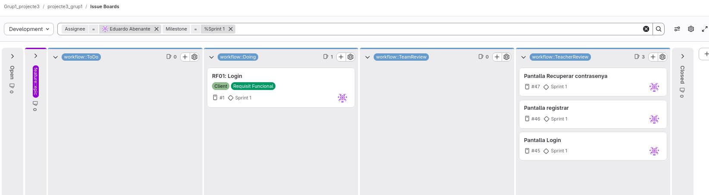

===== Diyae
.Imatge del board final

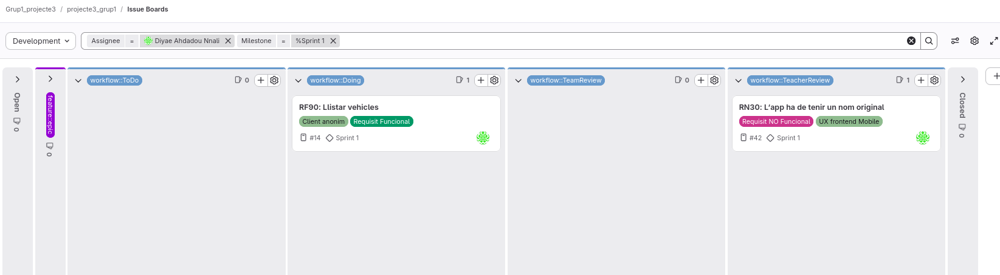

===== Angel
.Imatge del board final
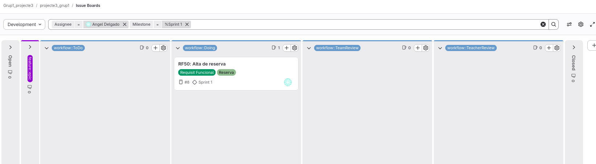

=== Retrospective Meeting

[cols="3*", options="header"]
|========================================================
|Aspectes positius | Aspectes a millorar | Accions concretes
| Ja tenim una base correcta amb la qual podrem treballar durant la resta de sprints
| Caldria informar-se millor respecte a com funciona Kotlin amb Jetpack Compose
| Mirar amb més detall la documentació
|========================================================

== Sprint 2

=== Planificació inicial 

==== Board inicial 

===== Eduardo
.Imatge del board inicial

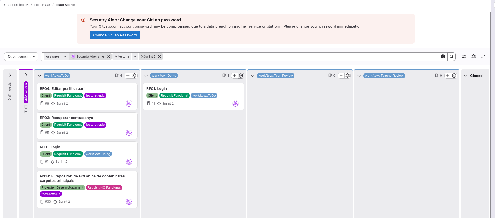

===== Diyae
.Imatge del board inicial

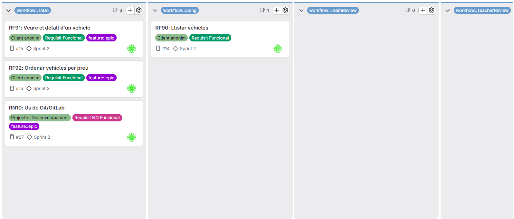

===== Angel

=== Daily Standups
==== Divendres 20 de Febrer
[cols="5*", options="header"]
|=====================================================================
| Integrant | Què es va fer ahir | Què es farà avui | Quins problemes o preocupacions es tenen | Hores treballades (classe/casa)

| Eduardo
| Implementació inicial de mobile, creació de l’estructura (core) i inici del RF1: Login (capes data, domain i presentation)
| Distribuir la feina del nou sprint, acabar el RF01: Login, implementar sugerencies i correccions del sprint a les pantalles de login i registre
|
| 6/0

| Diyae
| Creació de la plantilla de la llista de vehicles i part de la implementació de la lògica.
| Terminar de conectar el viewmodel de la lista de vehicles amb la base de dades.
| Cap
| 6/0

| Angel
| Començament de UI per a la implementació de la feature alta reserva
| Fer les plantilles atrasades de l'esprint 1, llistar reservas y veure detalls de les reserves
| Cap
| 6/0
|=====================================================================

====  Diumenge 22 de Febrer
[cols="5*", options="header"]
|=====================================================================
| Integrant | Què es va fer ahir | Què es farà avui | Quins problemes o preocupacions es tenen | Hores treballades (classe/casa)
| Angel
| Fer les plantilles atrasades de l'esprint 1, llistar reservas y veure detalls de les reserves
| Enllaçar el backend y el frontend de crear reserves y tenir una primera versió
| -
| 0/5
|=====================================================================

==== Dilluns 23 de Febrer
[cols="5*", options="header"]
|=====================================================================
| Integrant | Què es va fer ahir | Què es farà avui | Quins problemes o preocupacions es tenen | Hores treballades (classe/casa)

| Eduardo
| Distribuir la feina del nou sprint, acabar el RF01: Login, implementar sugerencies i correccions del sprint a les pantalles de login i registre
| Acabar RF01: Login perque no va donar temps el dia anterior, començar a desenvolupar el RF03: Recuperar contrasenya
| -
| 6/0

| Diyae
| Terminar de conectar el viewmodel de la lista de vehicles amb la base de dades.
| Correcció d'errors i finalització de la part de lògica del RF90 (llista de vehicles).
| Cap
| 5/0

| Angel
| Enllaçar el backend y el frontend de crear reserves i tenir una primera versió
| Fer la pantalla de llistar les reserves d'un client i els botons per ordenarles de manera ascendent i descendent respecte a la data inicial
| -
| 6/0
|=====================================================================

==== Dimecres 25 de Febrer
[cols="5*", options="header"]
|=====================================================================
| Integrant | Què es va fer ahir | Què es farà avui | Quins problemes o preocupacions es tenen | Hores treballades (classe/casa)

| Eduardo
| Acabar RF01: Login perque no va donar temps el dia anterior, començar a desenvolupar el RF03: Recuperar contrasenya
| Acabar RF03: Recuperar contrasenya i començar amb RF04: Editar perfil d'usuari
| -
| 3/1

| Diyae
| Correcció d'errors i finalització de la part de lògica del RF90 (llista de vehicles).
| Canvi dels colors de la pàgina i creació del composable del RF91 relacionat amb els detalls d'un vehicle.
| Cap
| 3/2

| Angel
| Fer la pantalla de llistar les reserves d'un client i els botons per ordenarles de manera ascendent i descendent respecte a la data inicial
| Millorar la pantalla de creació de reserva
| -
| 3
|=====================================================================

==== Dijous 26 de Febrer
[cols="5*", options="header"]
|=====================================================================
| Integrant | Què es va fer ahir | Què es farà avui | Quins problemes o preocupacions es tenen | Hores treballades (classe/casa)

| Eduardo
| Acabar RF03: Recuperar contrasenya i començar amb RF04: Editar perfil d'usuari
| Acabar RF03, revisar les funcionalitats acabades, repasar codi
| -
| 4/2

| Diyae
| Canvi dels colors de la pàgina i creació del composable del RF91 relacionat amb els detalls d'un vehicle.
| Finalització del RF91 relacionat amb els detalls d'un vehicle. He fet la part de lògica del frontend i el backend. Composable de RF92 relacionat amb ordenar els vehicles per preu.
| Cap
| 4/1

| Angel
| Millorar la pantalla de creació de reserva
| Continuar amb la millora de la pantalla de creació de reserva, afegint una previsualització del preu de la reserva abants de crearla
| -
| 4/0
|=====================================================================

==== Board Final
===== Eduardo
.Imatge del board final
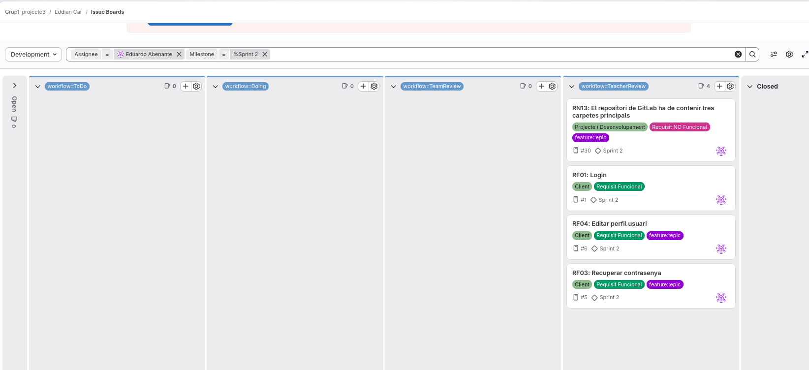

===== Diyae
.Imatge del board final
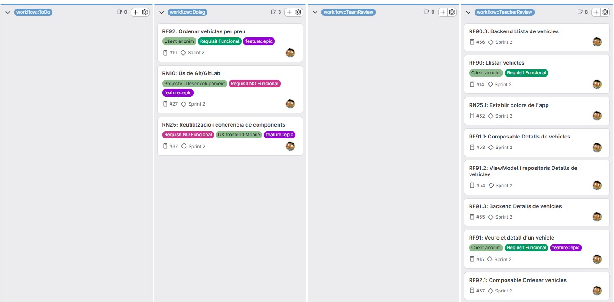

===== Angel
.Imatge del board final
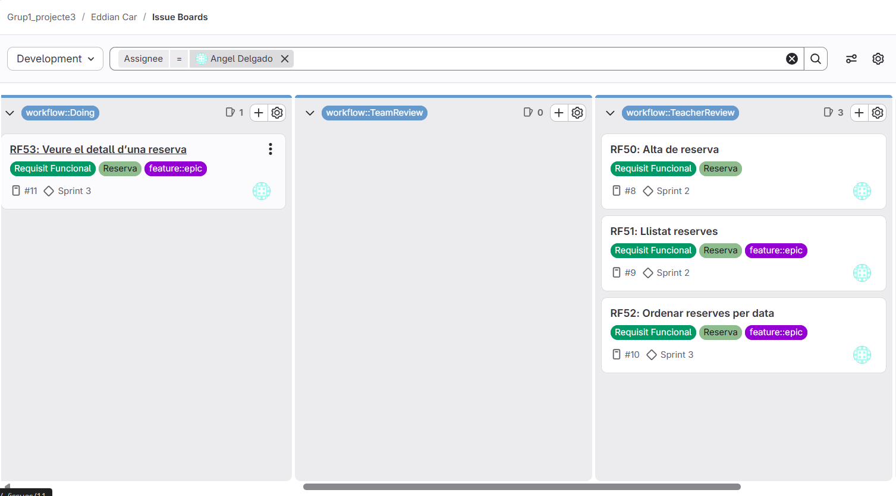

=== Retrospective Meeting
[cols="3*", options="header"]
|========================================================
|Aspectes positius | Aspectes a millorar | Accions concretes
| El ritme de treball ha estat correcte, s'ha aconseguit acomplir moltes tasques durant la setmana, ja es disposa de familiaritat amb el projecte i la seva estructura per tant es molt més comode treballar.
| Caldria treballar de forma més organitzada, ja que per voler annar massa rápid, no respectem la estructura del projecte, o trenquem funcionalitats que abans funcionaben per voler arreglar una altre.
| Fer un millor plantejament abans de començar a treballar, i si es necessari, para de programar per tornar a fer-se una idea del que es necessita fer abans de continuar.
|========================================================

== Sprint 3

=== Planificació inicial

==== Board inicial

===== Eduardo
.Imatge del board inicial

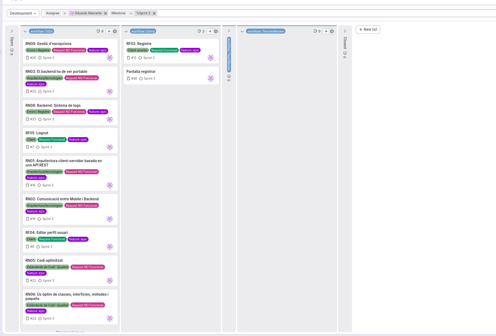

===== Diyae
.Imatge del board inicial

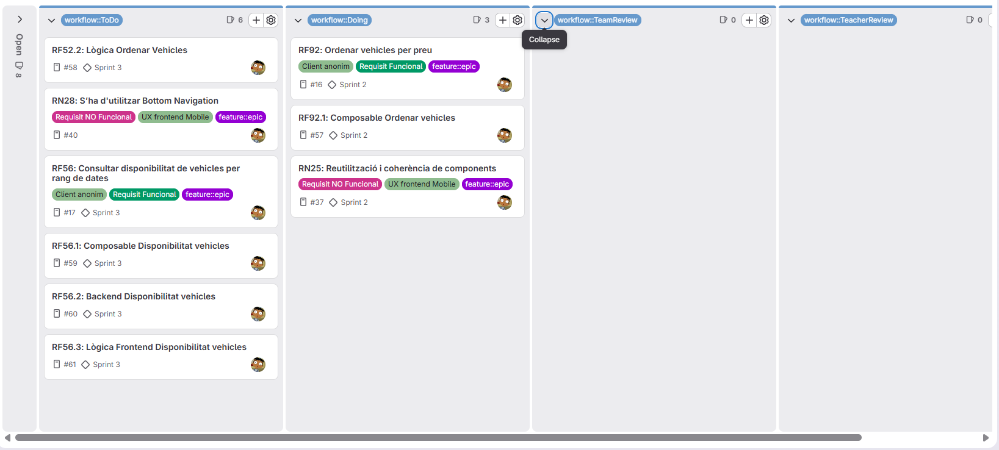

===== Angel 
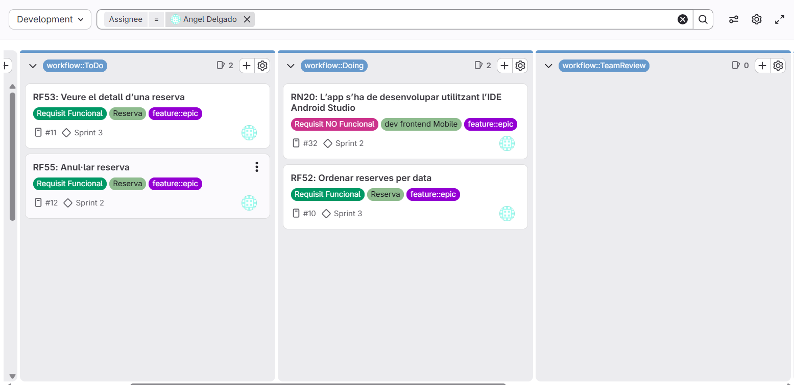

=== Daily Standups
==== Divendres 27 de Febrer
[cols="5*", options="header"]
|=====================================================================
| Integrant | Què es va fer ahir | Què es farà avui | Quins problemes o preocupacions es tenen | Hores treballades (classe/casa)

| Eduardo
| Acabar RF03: Recuperar contrasenya i començar amb RF04: Editar perfil d'usuari
| Assignar les tasques pel nou sprint, començar amb el RF de registre per poder acabar amb RF04: Editar perfil d'usuari
| Hi han molts Requisits no funcionals pendents.
| 3/0

| Diyae
| Finalització del RF91 relacionat amb els detalls d'un vehicle. He fet la part de lògica del frontend i el backend. Composable de RF92 relacionat amb ordenar els vehicles per preu.
| Canvis al composable del frontend del RF92 relacionat amb l'ordenació de vehicles per preu ascendent i descendent.
| Cap
| 3/0

| Angel
| Continuar amb la millora de la pantalla de creació de reserva, afegint una previsualització del preu de la reserva abants de crearla
| Acabar la millora de la pantalla de creacio de reserva y començar la pantalla de vista detallada d'una incidencia
| -
| 3/3
|=====================================================================

==== Dilluns 2 de Març
[cols="5*", options="header"]
|=====================================================================
| Integrant | Què es va fer ahir | Què es farà avui | Quins problemes o preocupacions es tenen | Hores treballades (classe/casa)

| Eduardo
| Assignar les tasques pel nou sprint, començar amb el RF de registre per poder acabar amb RF04: Editar perfil d'usuari
| Acabar amb el RF registre repsecte a la funcionalitat, caldrá pulir-ho per fer millor la UI i la gestió d'errors.
| -
| 6/0

| Diyae
| Canvis al composable del frontend del RF92 relacionat amb l'ordenació de vehicles per preu ascendent i descendent.
| Implementació del backend i la lògica del frontend del RF92 (repositoris, controllers, usecase i viewmodel) i intent de començar amb el Bottom Navigation.
| No em surt el Bottom Navigation, m'he d'informar millor
| 6/0

| Angel
|Acabar la millora de la pantalla de creacio de reserva y començar la pantalla de vista detallada d'una incidencia
| Acabar la vista detallada d'una incidencia y començar el botó per a eliminar reserva
| -
| 6/0
|=====================================================================

==== Dimecres 4 de Març
[cols="5*", options="header"]
|=====================================================================
| Integrant | Què es va fer ahir | Què es farà avui | Quins problemes o preocupacions es tenen | Hores treballades (classe/casa)

| Eduardo
| Acabar amb el RF registre repsecte a la funcionalitat, caldrá pulir-ho per fer millor la UI i la gestió d'errors.
| Millorar Registre, acabat amb el RF04: Editar usuari amb els canvis sugerits al sprint anterior.
| -
| 3/0

| Diyae
| Implementació del backend i la lògica del frontend del RF92 (repositoris, controllers, usecase i viewmodel) i intent de començar amb el Bottom Navigation.
| Com no em sort el Bottom Navigation, dedicaré temps als RFs més importants que he de fer i després tornaré a aquest RN. Avuí faré el composable i backend i lògica del RF56 relacionat amb el filtrat de vehicles segons dates.
| Cap
| 3/2

| Angel
|  Acabar la vista detallada d'una incidencia y començar el botó per a eliminar reserva
| Acabar el botó d'eliminar reserva
| -
| 3/0
|=====================================================================

==== Dijous 5 de Març
[cols="5*", options="header"]
|=====================================================================
| Integrant | Què es va fer ahir | Què es farà avui | Quins problemes o preocupacions es tenen | Hores treballades (classe/casa)

| Eduardo
| Millorar Registre, acabat amb el RF04: Editar usuari amb els canvis sugerits al sprint anterior.
| Fer el sistema de logout i millorar el sistema de login amb els canbis fets a l'enunciat, afegir logs al backend, refactoritzar i millorar el codi extreient strings i unificant la UI de les pantalles relacionades amb el client
| -
| 4/1

| Diyae
| Com no em sort el Bottom Navigation, dedicaré temps als RFs més importants que he de fer i després tornaré a aquest RN. Avuí faré el composable i backend i lògica del RF56 relacionat amb el filtrat de vehicles segons dates.
| Arreglar uns últims detalls dels RFs de la llista de vehicles i del filtrat per dates i tornar a començar amb el RN del Bottom Navigation
| Cap
| 4/0

| Angel
| Acabar el botó d'eliminar reserva
| Fer Readme del projecte  , documentació variada i provar la branca develop per asegurar que no hi han errors
| -
| 4/0
|=====================================================================

==== Board Final
===== Eduardo
.Imatge del board final
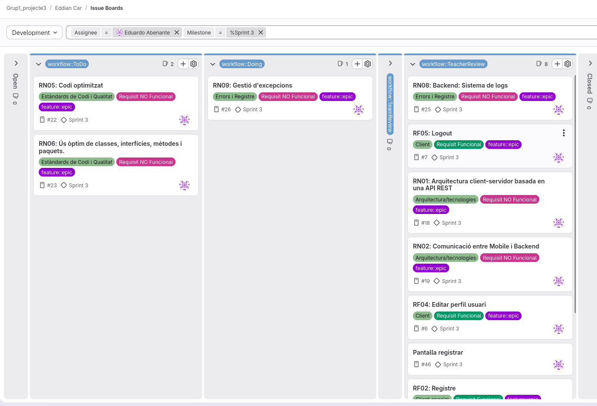

===== Diyae
.Imatge del board final
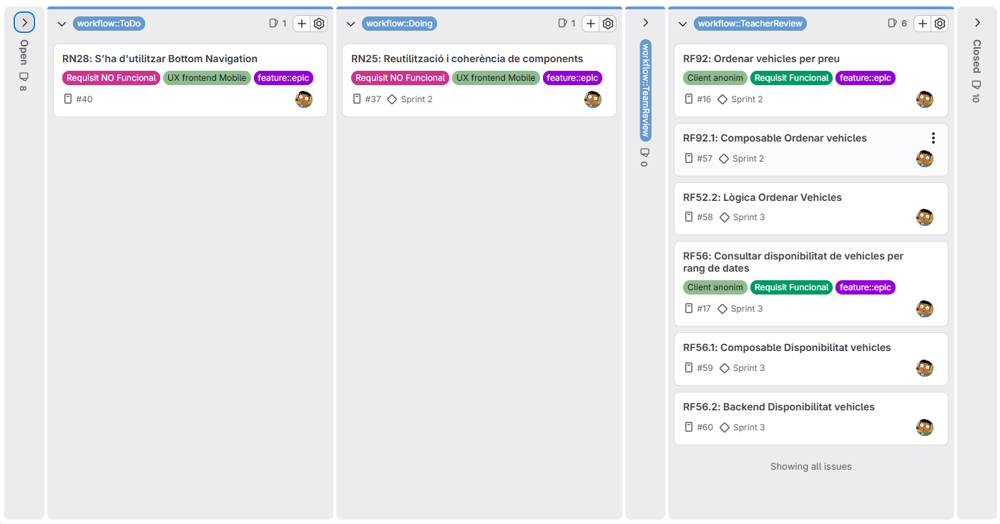

===== Angel
.Imatge del board final
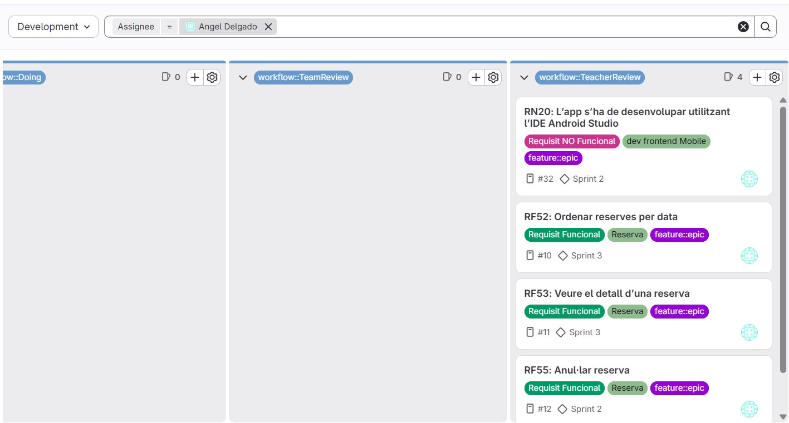

=== Retrospective Meeting
[cols="3*", options="header"]
|========================================================
|Aspectes positius | Aspectes a millorar | Accions concretes
| Hem aconseguit deixar la major part del projecte enllestit, això ens permetrà la setmana següent poder revisar tot el projecte i acabar amb els issues que faltin amb tranquilitat.
| Potser hem prioritzat la velocitat en aquest sprint i existeix la possibilitat que la setmana següent, tot i que tindrem temps haurem de revisar molt bé tota la feina feta.
| Cal assegurar que la feina es correcta abans de passar a un altre, prioritzar qualitat abans que quantitat.
|========================================================